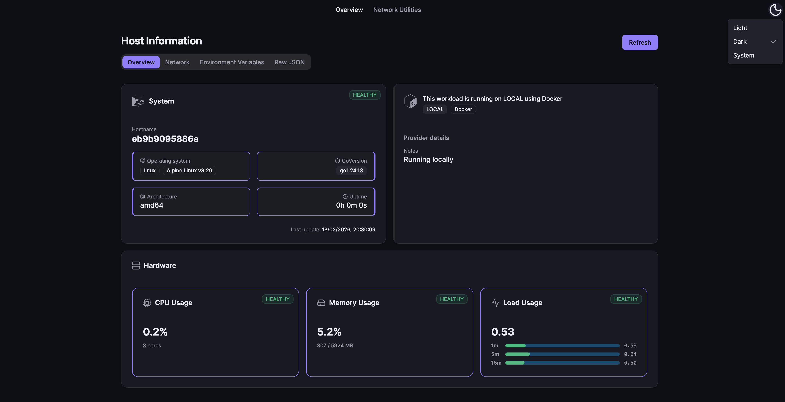
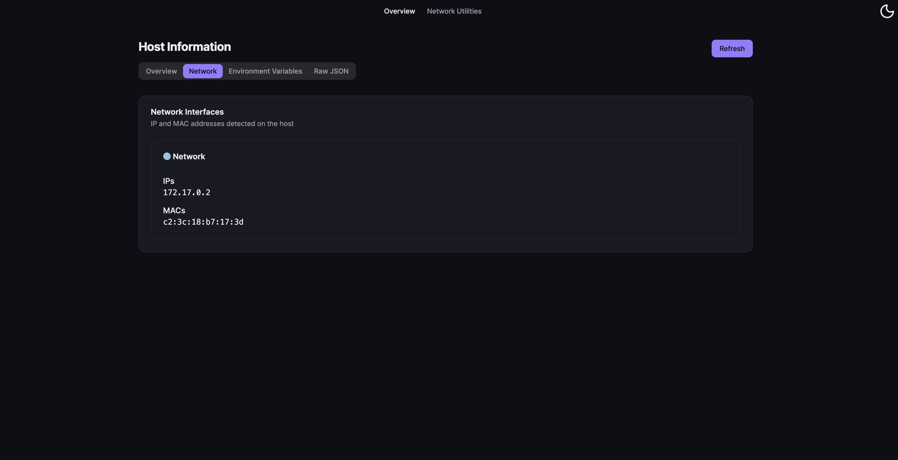
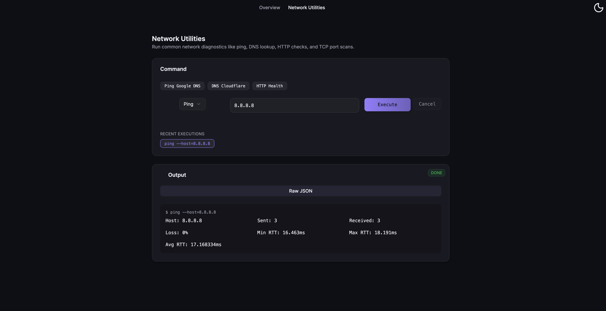

<h1 align="center">HostInfo</h1>
<p align="center">Lightweight Go-based Host Telemetry Service</p>

<p align="center">
  <a href="https://github.com/MaksymLeus/hostinfo/releases">
    
  </a>
  <a href="https://github.com/MaksymLeus/hostinfo/actions/workflows/ci.yml">
    
  </a>
  <a href="https://hub.docker.com/r/maximleus/hostinfo">
    
  </a>
  <a href="LICENSE">
    
  </a>
</p>

<p align="center">
  
  
</p>

<p align="center">
  <b>HostInfo</b> is a lightweight, container-ready Go service that exposes structured system, runtime, and environment information through a Web dashboard and a versioned REST API.
</p>

It is designed for **DevOps engineers, SREs, platform teams, automation systems, and homelab operators** who need fast, portable host telemetry.



## ✨ Features

- 🚀 Fast & minimal Go HTTP server
- 🌐 Clean Web dashboard
- 📡 Versioned REST API (`/api/v1`)
- ☁️ Cloud detection (AWS / GCP / Azure / Local)
- 🐳 Docker & Docker Compose ready
- ☸️ Kubernetes-ready (Helm chart included)
- 🔒 Zero external runtime dependencies
- 🩺 Liveness & readiness probes
- 🧱 Clean layered architecture
- 📚 Structured documentation

See [`docs/OVERVIEW.md`](docs/OVERVIEW.md) for full overview.

## 🚀 Quick Start

### Docker Compose (Recommended)
```bash
docker compose up -d
```

### Docker
```bash
docker run -p 8080:8080 maximleus/hostinfo:latest
```

### From Source
```bash
# Build
./tools/build.sh

# Run
./bin/hostinfo
```

Access at: **http://localhost:8080**

### ☸️ Deploy with Helm
helm upgrade --install hostinfo ./helm \
  --namespace hostinfo \
  --create-namespace

See [`docs/DEPLOYMENT.md`](docs/DEPLOYMENT.md) for full deployment guide.


## Screenshots

| Network | Raw Json |
|:---:|:---:|
|  |  |

| Command - Ping | Command List |
|:---:|:---:|
|  |  |

## 🔌 API Examples
HostInfo exposes a REST API for system, cloud, and network diagnostics.

### Health Checks
```bash
curl http://localhost:8080/healthz
curl -s http://localhost:8080/healthz/live | jq
curl -s http://localhost:8080/healthz/ready | jq
```

### Host information
```bash
curl -s http://localhost:8080/api/v1/info | jq
```

### Network Utilities
```bash
# Ping a host
curl -s "http://localhost:8080/api/v1/ping?host=google.com" | jq

# DNS lookup
curl -s "http://localhost:8080/api/v1/dns?host=google.com" | jq

# TCP port check
curl -s "http://localhost:8080/api/v1/tcp?host=google.com&port=80" | jq
```

See [`docs/API.md`](docs/API.md) for full API reference.

## ⚙️ Configuration

| Variable         | Default   | Description       |
| ---------------- | --------- | ----------------- |
| `HOSTINFO_PORT`  | `8080`    | Port to listen on |
| `HOSTINFO_HOST`  | `0.0.0.0` | Bind address      |
| `HOSTINFO_DEBUG` | `false`   | Enable debug mode |

See [`docs/CONFIGURATION.md`](docs/CONFIGURATION.md) for full configuration reference.

## 📚 Documentation

Project documentation lives inside the `/docs` directory:

| Document           | Purpose                                 |
| ------------------ | --------------------------------------- |
| `OVERVIEW.md`      | Architecture, goals, internal structure |
| `API.md`           | REST API endpoints & schemas            |
| `CONFIGURATION.md` | Environment variables & configuration   |
| `DEPLOYMENT.md`    | Docker, Compose, Helm, Kubernetes       |
| `DEVELOPMENT.md`   | Local development workflow              |
| `TODO.md`          | Roadmap & planned improvements          |

## Tech Stack

**Backend:** Go 1.24+, Echo, pro-bing, gopsutil

**Frontend:** Node 23.13+, NPM 11.6+, Vite

## Contributing
1. Fork the repository
2. Create a feature branch (`git checkout -b feature/amazing-feature`)
3. Commit your changes (`git commit -m 'feat: Add amazing feature'`)
4. Push to the branch (`git push origin feature/amazing-feature`)
5. Open a [Pull requests](https://github.com/MaksymLeus/hostinfo/pulls)
   
See [`docs/DEVELOPMENT.md`](docs/DEVELOPMENT.md) for development setup.

## 📄 License
MIT License — see [`LICENSE.md`](LICENSE.md) for details.

## Support

- [GitHub Issues](https://github.com/MaksymLeus/hostinfo/issues)
- [API Documentation](docs/API.md)